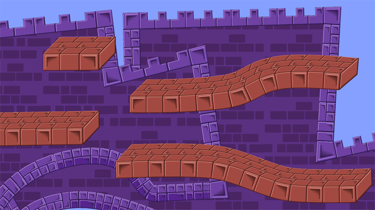
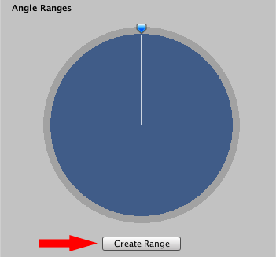
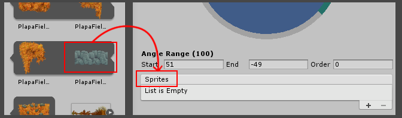
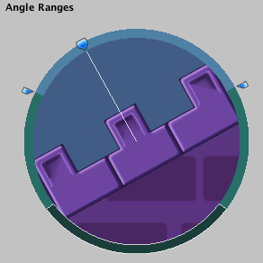
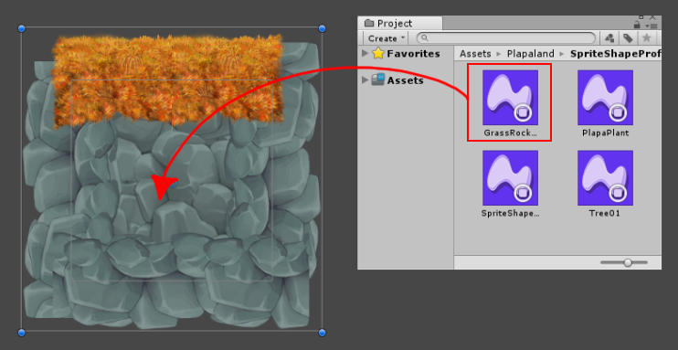
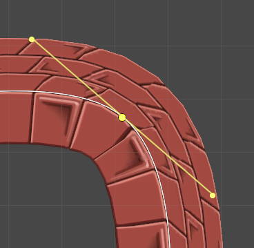
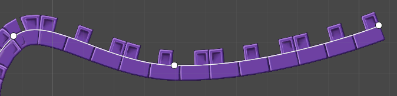
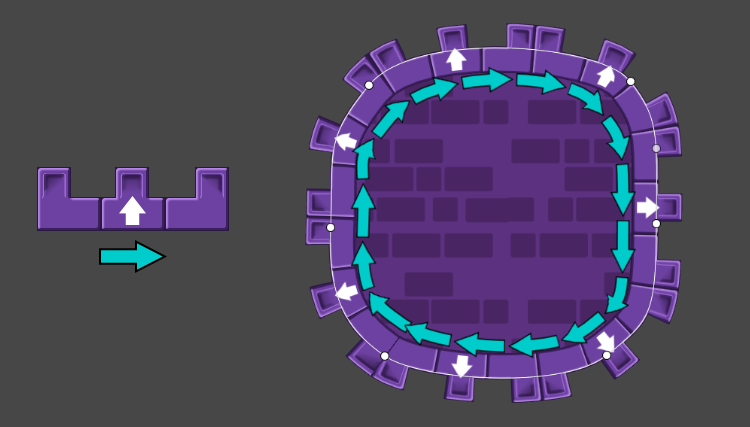

2D Sprite Shape Package

# Overview

**Sprite Shapes** are powerful worldbuilding Assets and tools that allow you to construct entire levels easily and quickly. The following levels are constructed with only **Sprite Shapes**.

# Reference Tables

## Sprite Shape Profile Properties

<table>
  <tr>
    <td><b>Properties</b></td>
    <td><b>Functions</b></td>
  </tr>
  <tr>
    <td><b>Control Points</b></td>
    <td>-</td>
  </tr>
  <tr>
    <td><b>Use Sprite Borders</b></td>
    <td>Control points at both ends of the spline path are capped by Sprite Borders</td>
  </tr>
  <tr>
    <td><b>Bevel Cutoff</b></td>
    <td>Angle that corners become bevels. 
Only affects a Control Point, if it and its neighbors are all in Linear Point Mode</td>
  </tr>
  <tr>
    <td><b>Bevel Size</b></td>
    <td>Length of slope at corners.
Only affects a Control Point, if it and its neighbors are all in Linear Point Mode</td>
  </tr>
  <tr>
    <td><b>Fill</b></td>
    <td>-</td>
  </tr>
  <tr>
    <td><b>Texture</b></td>
    <td>Texture used to fill an enclosed spline path.
Has no effect if Spline is set to 'Open Ended'.</td>
  </tr>
  <tr>
    <td><b>Pixels Per Unit</b></td>
    <td>Pixels per unit value of the Fill texture. Fill texture scale is adjusted by this value.</td>
  </tr>
  <tr>
    <td><b>World Space UV</b></td>
    <td>Enable to apply fill texture per World Space UV. Disable to apply texture per GameObject UV instead.</td>
  </tr>
  <tr>
    <td><b>Offset</b></td>
    <td>Amount of offset at the edges of the fill texture</td>
  </tr>
  <tr>
    <td><b>Angle Ranges (tool)</b></td>
    <td>The tool used to assign Sprites to specified angle ranges. </td>
  </tr>
  <tr>
    <td><b>Start (degrees)</b></td>
    <td>The starting angle of the selected angle range</td>
  </tr>
  <tr>
    <td><b>End (degrees)</b></td>
    <td>The ending angle of the selected angle range</td>
  </tr>
  <tr>
    <td><b>Order</b></td>
    <td>Determines which Sprites are rendered above others when multiple Sprites overlap. Higher values are rendered above lower ones.</td>
  </tr>
  <tr>
    <td><b>Sprites (list)</b></td>
    <td>List of Sprites attached to the currently selected angle range, with 0 being the first Sprite in the list and the default Sprite displayed.</td>
  </tr>
  <tr>
    <td><b>Corners</b></td>
    <td>-</td>
  </tr>
  <tr>
    <td><b>(all options)</b></td>
    <td>Assign Sprites to each of the respective corners.
Settings takes effect only if Control Points and their neighbors are to Linear Point Mode, and Open Ended is unchecked in the Sprite Shape Controller properties</td>
  </tr>
</table>

## Sprite Shape Controller Properties

**Sprite Shape Controller** component Inspector window and property settings

_* Property is only available when a Control Point is selected_

<table>
  <tr>
    <td><b>Properties</b></td>
    <td><b>Functions</b></td>
  </tr>
  <tr>
    <td><b>Edit Spline</b></td>
    <td>Click this to edit the control points of the current Sprite Shape </td>
  </tr>
  <tr>
    <td><b>Point Mode</b></td>
    <td>Sets the editing mode of the selected control point. Options are disabled if Edit Spline is not enabled</td>
  </tr>
  <tr>
    <td><b>Linear</b></td>
    <td>No curve is created between the two lines at this control point</td>
  </tr>
  <tr>
    <td><b>Mirrored</b></td>
    <td>Edits to the tangent is mirrored on both sides of the control point</td>
  </tr>
  <tr>
    <td><b>Non-Mirrored</b></td>
    <td>Edit the tangents individually on either side of the control point</td>
  </tr>
  <tr>
    <td><b>Snapping</b></td>
    <td>Enable to have Control Points snap using editor snap settings</td>
  </tr>
  <tr>
    <td><b>Sprite Shape</b></td>
    <td>The Sprite Shape Profile currently selected</td>
  </tr>
  <tr>
    <td><b>* Point Position</b></td>
    <td>XY coordinates of the selected Control Point</td>
  </tr>
  <tr>
    <td><b>* Height</b></td>
    <td>The height of Sprites are scaled at the selected Control Point by this value</td>
  </tr>
  <tr>
    <td><b>* Bevel Cutoff</b></td>
    <td>Angle when corners become curved bevels. Overrides original Bevel Cutoff set in the Sprite Shape Profile</td>
  </tr>
  <tr>
    <td><b>* Bevel Size</b></td>
    <td>Extent of bevelled curve</td>
  </tr>
  <tr>
    <td><b>* Sprite Index</b></td>
    <td>Value determines which Sprite from the Sprite Profile list displays for the selected Control Point </td>
  </tr>
  <tr>
    <td><b>* Corner</b></td>
    <td>-</td>
  </tr>
  <tr>
    <td><b>Disabled</b></td>
    <td>Default option. The selected Control Point is not automatically assigned a Corner Sprite. </td>
  </tr>
  <tr>
    <td><b>Automatically</b></td>
    <td>Enable to apply assigned Corner Sprite to the selected Control Point. 

Note: For the Corner Sprites to appear, the Control Point and its nieghbors must be in Linear Point Mode.</td>
  </tr>
  <tr>
    <td><b>Spline</b></td>
    <td>-</td>
  </tr>
  <tr>
    <td><b>Detail</b></td>
    <td>Tessellation quality of rendered Sprite Shape</td>
  </tr>
  <tr>
    <td><b>Open Ended</b></td>
    <td>Enabled by default. Ends of the Spline path remain unconnected.

Uncheck to disable this option. Ends of the Spline path are automatically connected to form an enclosed space, displaying the Fill texture (if set)</td>
  </tr>
  <tr>
    <td><b>Adaptive UV</b></td>
    <td>Enable to ensure that Sprite textures are seamlessly connected across the rendered Spline path</td>
  </tr>
  <tr>
    <td><b>Collider</b></td>
    <td>-</td>
  </tr>
  <tr>
    <td><b>Detail</b></td>
    <td>Tessellation quality of the collider mesh</td>
  </tr>
  <tr>
    <td><b>Corner Type</b></td>
    <td>Select from Square/Round/Sharp. Determines the shape of corners of the collider mesh</td>
  </tr>
  <tr>
    <td><b>Offset</b></td>
    <td>Measures the distance of the Collider's edge from the Spline path. When Open Ended is unchecked, positive values expand the mesh outwards, while negative values constricts the mesh inwards.

When Open Ended is checked, only positive values affect the mesh.</td>
  </tr>
</table>

## Creating a Sprite Shape Profile Asset

The **Sprite Shape Profile** is an Asset that contains Sprites and determines how they behave along a Spline path. To create a **Sprite Shape Profile** Asset, go to **menu: Assets > Create > Sprite Shape Profile**

There are 3 options available: **Empty/Strip/Shape.** Select the **Empty** profile to create the default profile with no preset settings for now. The **Strip** profile contains a single angle range from 180&deg;C to -180&deg;C, and the **Shape** profile contains 8 equal angle range segments.

With the newly created **Sprite Shape Profile** Asset selected, go to the Angle Ranges tool in the middle of its Inspector window.

## Assigning Sprites and Creating Angle Ranges

## 

Click _Create Range_ under the Angle Ranges tool, or click anyway along the edge of the circle to create an angle range centered around the cursor.

To adjust the span and position of an angle range, click and move its endpoints to the desired angles.

At the bottom of the angle ranges tool, manually adjust the values for the Start and End points of a selected angle range to further refine it. To delete an angle range, first select the range to be removed, then delete it with the **Shift+Del**/**Cmd+Del** keys.

Beneath the Angle Range tool is a list that shows all the Sprites currently assigned to the selected angle range.

Drag a **Sprite** onto the title 'Sprites' to add it to the list. Repeat  the same step to add more **Sprites** to the list. The **Sprite** at the top of the list is rendered in the Scene by default, and newer **Sprites** are added to the bottom of the list. 

Drag the leftmost-corners of the **Sprites** up or down to reorder them as needed. The order of the **Sprites** in the list determines their **Sprite Index** number.

Selecting a **Sprite** from the list opens a preview of the **Sprite** in the angle range tool. Moving the blue Preview Handle allows you to preview how the Sprite looks at various angles within its angle range.

## Editing a Sprite Shape in the Scene

Drag the **Sprite Shape Profile** asset into the Scene View to create a **Sprite Shape GameObject** based on the Profile settings.

To edit the Spline path of the **Sprite Shape**, click *Edit Spline* to make the Spline path and its Control Points become visible and editable.

Add additional Control Points by clicking anywhere along the Spline. Select and move Control Points to adjust the shape and length of the spline path. Create more Control Points by clicking anywhere along the spline path without an existing control point.

### Control Point Modes

When a Control Point is selected, three modes become available in the Inspector window. These **Point Modes** are *Linear, Mirrored,* and *Non-Mirrored.*

Point Modes control the behavior of the key tangents of a selected Control Point. These tangents control the shape of the curve between them, affecting how the Sprite Shape looks or behaves.

#### Linear Point Mode

In Linear Point Mode, there are no key tangents at the selected Control Point. The curvature 	of the Spline path is adjusted by the *Bevel Cutoff* and *Bevel Size* settings set in the **Sprite Shape Profile** Asset.

For each Control Point, you can override the Asset settings by changing the same settings in the **Sprite Shape Controller** properties.

#### Mirrored/Non-Mirrored Point Mode

In these two modes, key tangents appear on either side of the selected Control Point. Manipulating the tangents allows you to adjust the curve of the Spline path. In these two modes, both the *Bevel Cutoff* and *Bevel Size* settings do not affect Control Points.

In Mirrored mode, changes to one tangent is mirrored on the opposite tangent. In Non-Mirrored mode, each tangent is adjusted individually.

### Open-Ended Sprite Shapes

Unity extracts the input Sprites of a Sprite Shape horizontally and maps them clockwise along the Spline path.

With *Open-Ended* left unchecked in the **Sprite Shape Controller**, you can freely extend the Spline path to create platforms or other level elements.

 

Foliage and tree created with Open-Ended Sprite Shapes

### Enclosed Sprite Shapes

When the *Open-Ended* property is unchecked, the two ends of a Spline path become connected. If a *Fill* texture is defined in the **Sprite Shape Profile**, it is displayed within the enclosed Sprite Shape.

