2D Sprite Shape

# Overview

A **Sprite Shape** is an Asset that contains multiple Sprites assigned to specific angles. When rendered in a Scene, a Sprite Shape tiles assigned Sprites along its spline path or outline, automatically deforming and changing the Sprites displayed depending on its settings.

In this way, Sprite Shapes are powerful worldbuilding tools that allow you to construct your game world quickly and efficiently. The following examples demonstrate the different ways to construct levels using different kinds of Sprite Shapes.

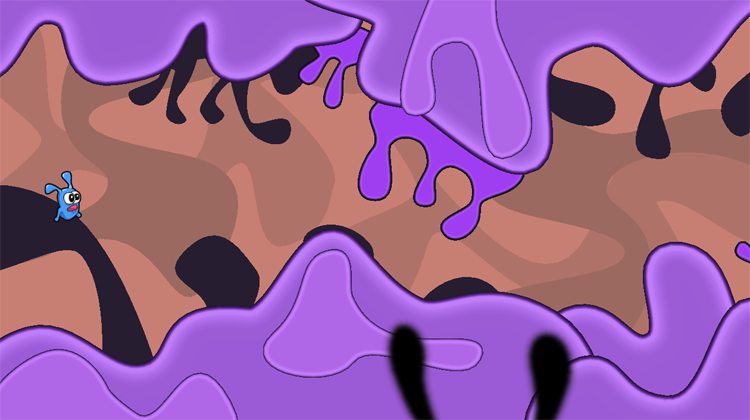

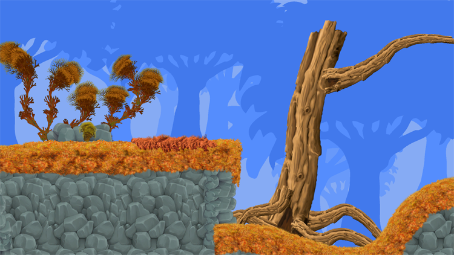
 Fig 1: Examples of level designs using Sprite Shapes 

There are two parts to creating and editing Sprite Shapes, namely the **[Sprite Shape Profile](#SS-Profile)**, and the **[Sprite Shape Controller](#anchor-SS-Control)**. The Sprite Shape Profile** **contains the settings for the Sprite Shape Asset, such as all the Sprites included in the shape and the angle ranges that they are assigned to. The Sprite Shape Controller component allows you to edit a Sprite Shape’s outline into different shapes.

# Sprite Shape Profile

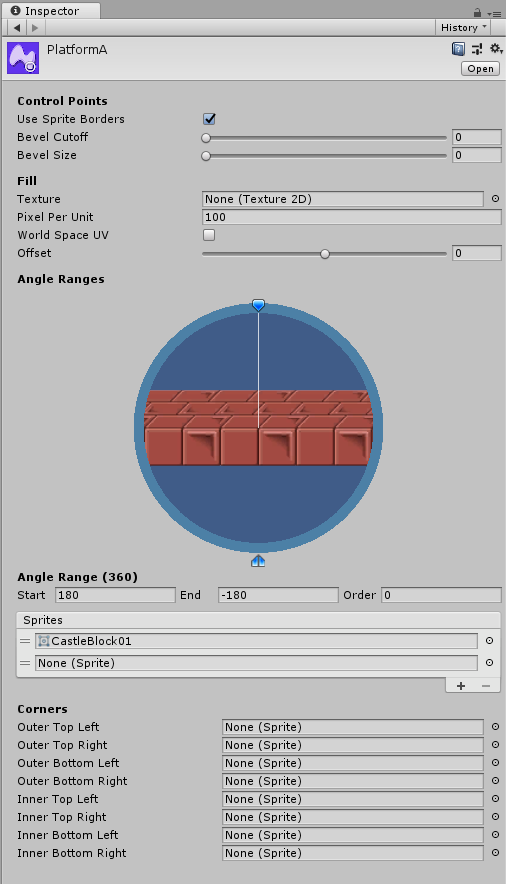
 Fig 2: Sprite Shape Profile Inspector window and settings
  

|**Property**|**Function**|
| --- | --- |
|**Control Points**|-|
|&nbsp;&nbsp;**Use Sprite Borders**|Enable to cap both ends of an Open-Ended spline path. Assign the Sprites to be used as bookends in the Sprite Editor.|
|&nbsp;&nbsp;**Bevel Cutoff**|The angle threshold when corners are bevelled. Only has an effect if the Control Point and its neighbors are in *Linear Point mode*.|
|&nbsp;&nbsp;**Bevel Size**|Length of slant at bevelled corners. Only has an effect if the Control Point and its neighbors are in *Linear Point mode*.|
|**Fill**|-|
|&nbsp;&nbsp;**Texture**|Set the texture to fill a closed Sprite Shape. Has no effect if the Spline is set to Open Ended.|
|&nbsp;&nbsp;**Pixels Per Unit**|The pixels per unit value of the Fill texture of a Sprite Shape. This value affects the scale of the Fill texture, with higher values reducing the size of the texture.|
|&nbsp;&nbsp;**World Space UV**|Enable to apply the Fill texture per the World Space UV, instead of per Object UV.|
|&nbsp;&nbsp;**Offset**|Determines the border offset at the edges of the Fill texture.|
| 
**Angle Ranges (tool)**
    |Assign Sprites to specific angle ranges with this tool.|
|&nbsp;&nbsp;**Start (degrees)**|The starting angle for the selected angle range.|
|**End (degrees)**|The endpoint for the selected angle range.|
|&nbsp;&nbsp;**Order**|Determine the priority of Sprites when they overlap each other. Sprites with higher values are rendered above lower ones.|
|&nbsp;&nbsp;**Sprites (list)**|List of Sprites assigned to the selected angle range. The default Sprite is always the one at the top of the list.|
|**[Corners](#AssignCorners)**|-|
|&nbsp;&nbsp;**All Corner options**|Assign selected Sprites to the different corners. When the Sprite Shape is rendered in the Scene, the assigned Sprites are displayed at their respective corners, or is left blank if no Sprite was assigned.  Note that a Corner Sprite is only displayed if the Control Point and its neighbors are in Linear Point Mode.|

# Sprite Shape Controller

 Fig 3: Sprite Shape Controller Inspector window 

*( + ) - Property is only visible when a Control Point is selected*

|**Property**|**Function**|
| --- | --- |
|**Edit Spline**|Enable to edit the Control Points of the current **Sprite Shape**.|
|**Point Mode**|Set the edit mode of the selected control point. Options are only available if *Edit Spline* is enabled.|
|&nbsp;&nbsp;
 **Linear**
 |No Bézier curve is created between the two tangent lines at this Control Point.|
|&nbsp;&nbsp;
 **Mirrored**
 |A Bézier curve is formed at this Control Point between the two tangent lines. Adjustment made to either tangent is mirrored on the opposite tangent.|
|&nbsp;&nbsp;
 **Mirrored**
 |A Bézier curve is formed at this Control Point between the two tangent lines. Adjustment made to either tangent is not mirrored on the opposite tangent.|
|**Snapping**|Enable to snap Control Points according to the Editor's snap settings.|
|**Sprite Shape +**|The Sprite Shape Asset rendered.|
|**Point Position +**|The x,y coordinates of the selected Control Point.|
|**Height +**|Slider to scale the height of Sprites at the selected Control Point.|
|**Bevel Cutoff +**|Slider to set the angle cut-off that corners become bevels. Overrides Bevel Cutoff set in the Sprite Shape Profile.|
|**Bevel Size +**|Slider to set the length of the slant of the bevel.|
|**Sprite Index +**|Slider to set the Sprite Index number for the Control Point. The Sprite with the same index number from the Sprite Shape Profile’s Sprite list is displayed. Cycle through all Sprites in the list with the ‘N’ key when selecting a Control Point.|
|**Corner +**|-|
|&nbsp;&nbsp;Disabled|Default option. The selected Control Point does not automatically display a Corner Sprite.|
|&nbsp;&nbsp;Automatically|The Control Point displays the assigned Corner Sprite. Note that the Sprites are only displayed if the Control Point and its neighbors are in Linear Point Mode.|
|**Spline**|-|
|&nbsp;&nbsp;Detail|Tessellation quality of the rendered Sprite Shape.|
|&nbsp;&nbsp;Open Ended|Enabled by default. Control Points at both ends of the spline remain unconnected, and the Sprite Shape displays no Fill texture. Uncheck to disable this option.  Control Points at both ends of the spline path are automatically connected to form a closed Sprite Shape, and the set Fill texture is displayed.|
|&nbsp;&nbsp;Adaptive UV|Enable to have Sprite textures appear seamlessly connected.|
|**Collider**|Note: The following Collider options are only displayed if either the Polygon Collider 2D or Edge Collider 2D component is attached to the Sprite Shape.|
|&nbsp;&nbsp;Detail|Tessellation quality of the collider mesh.|
|&nbsp;&nbsp;Corner Type|Select from Square/Round/Sharp. Determines the shape of the collider mesh corners.|
|&nbsp;&nbsp;Offset|Sets the distance between the Sprite Shape’s spline path and the Collider mesh's edge.When Open Ended is checked, only positive values affect the mesh.When Open Ended is unchecked, positive values expand the mesh outwards, while negative values constricts the mesh inwards.|

# What is a Sprite Shape Profile

To use a Sprite Shape, you begin by creating a **Sprite Shape Profile**. A Sprite Shape Profile is an Asset that contains the Sprites that make up the Sprite Shape, and settings such as the angles that those Sprites are displayed at. 

Go to **Assets** > **Create** > **Sprite Shape Profile**, and there are three *Profile* options available - *Empty, Strip, Shape*

The *Empty* profile is the default, and contains no preset settings or angle ranges. The *Strip* profile is a preset that prepares Sprite Shapes for long continuous segments. For example, if you want to create platforms, or background details like a tree line.

 Fig 4: Example of Platform created from the *Strip *preset

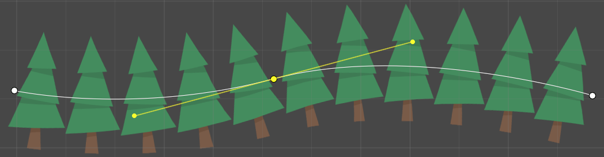
 Fig 5: Example of background treeline element created from the *Strip* preset 

The *Shape* preset comes with 8 equal Angle Ranges. After assigning Sprites to each range, dragging the Sprite Shape onto the Scene creates an enclosed Sprite Shape.  If a Fill texture is set, then the Sprite Shape displays the Fill texture within itself. This makes Sprite Shapes useful for creating and shaping backgrounds, platforms, or other kinds of worldbuilding elements in your Project.

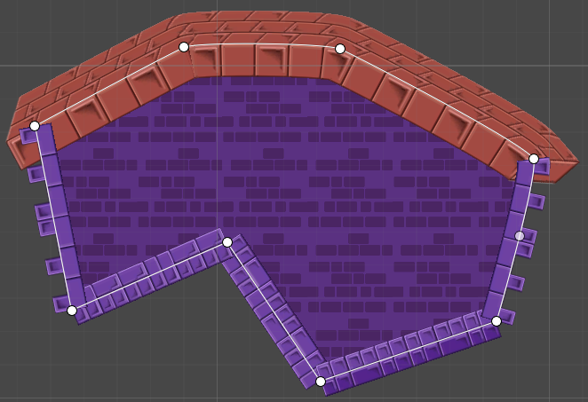
 Fig 6: An example platform created from the *Shape* preset

# Creating a Sprite Shape Profile

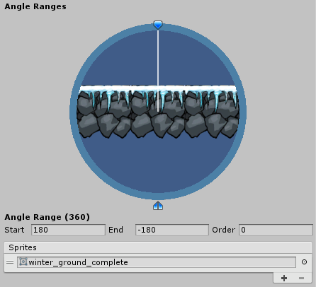
 Fig 7: The Angle Ranges tool 

A key feature of the **Sprite Shape Profile** is the Angle Ranges tool. Assigning an Angle Range determines what Sprite is displayed at specific angles, as the Sprite Shape is deformed in the Scene.

## Creating an Angle Range

1. Click the *Create Range* button at the bottom of the Angle Ranges tool.  
 Fig 8: ‘Create Range’ button

    a. If the button is not visible, select and move the *Preview* *Handle *to an area without an Angle Range. The *Create Range* button should then appear. 
	  &nbsp;&nbsp;&nbsp;&nbsp; &nbsp;&nbsp;&nbsp;&nbsp;&nbsp;Fig 9: Selecting the blue Preview Handle

2.  An Angle Range is created centred on the *Preview Handle.*  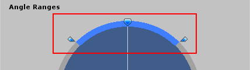 Fig 10: Blue area shows active Angle Range

    b. Another way to create an Angle Range is to hover the mouse over an empty area along the range circle. An outline appears to show the possible range. &nbsp;&nbsp;&nbsp;&nbsp;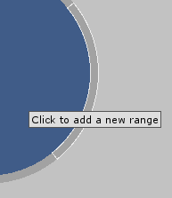 &nbsp;&nbsp;&nbsp;&nbsp;&nbsp;Fig 11: Creating an Angle Range on an empty space
	
&nbsp;&nbsp;&nbsp;&nbsp;Left-click to create a range in the highlighted area.

	c. The range covered by the currently selected Angle Range is displayed at the bottom of the tool.
	 &nbsp;&nbsp;&nbsp;&nbsp;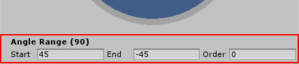 &nbsp;&nbsp;&nbsp;&nbsp;&nbsp;Fig 12: Enter the respective values here
	
&nbsp;&nbsp;&nbsp;&nbsp;Edit a range by entering new values into *Start* and *End*, or drag either endpoint to the desired angles. Note that the endpoint of a range cannot be extended into a neighboring range.

4. To delete an Angle Range, select the range then press the **Del/Delete** key.

## Assigning Sprites

After creating an Angle Range, the next step is to assign Sprites to that range.

 Fig 13: The empty default Sprite List

Beneath the **Angle Ranges** tool is the **Sprites** list that shows all the Sprites currently assigned to that range.

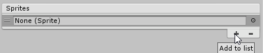
 Fig 14: Adding a Sprite row to the list

To add Sprites to the list, click the **+** icon to insert a new row to the list.  Click the circle icon next to the empty row to open the **Object Picker** window, which displays all available Sprites in the project.

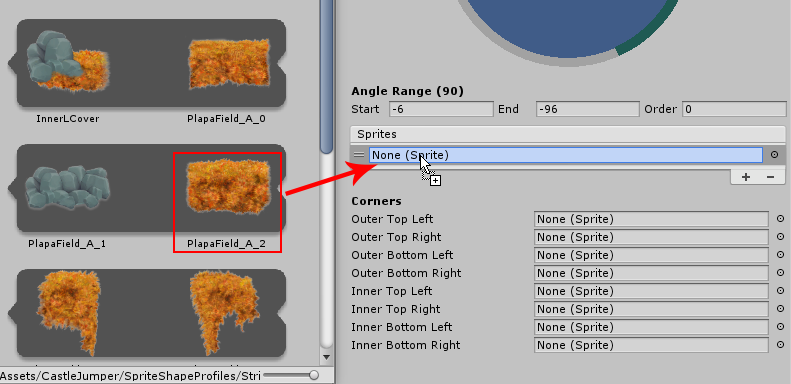
 Fig 15: Dragging a Sprite onto a row

Another way to add Sprites is to simply drag a Sprite onto a row to add it. Repeat the same steps to add more Sprites to the list. The default Sprite displayed is the one at the top of the list. The other Sprites in the list are displayed by referring to their respective Sprite Index numbers. 

Drag the leftmost ends of the rows up or down to reorder them. Changing the order of the Sprite rows also changes their [Sprite Index](#heading=h.y4m8y4ub6hlu) number. 

## Previewing Multiple Angle Ranges

After creating multiple Angle Ranges and assigning different Sprites, you can preview the Sprites as they appear at their assigned angles by rotating the Preview Handle around the tool. 

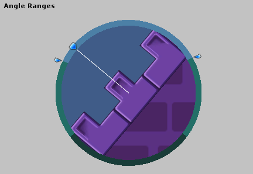
 Fig 16: Sprites are displayed within the Angle Range they are assigned to

 Fig 17: Rotate the Preview Handle to preview the assigned Sprites at each angle

# Open-Ended Sprite Shapes

The *Strip* preset is ideal to create continuous platforms (see Fig 18). These Sprite Shapes can be extended or deformed as needed for your Project, with the Sprites automatically tiling along the spline path.

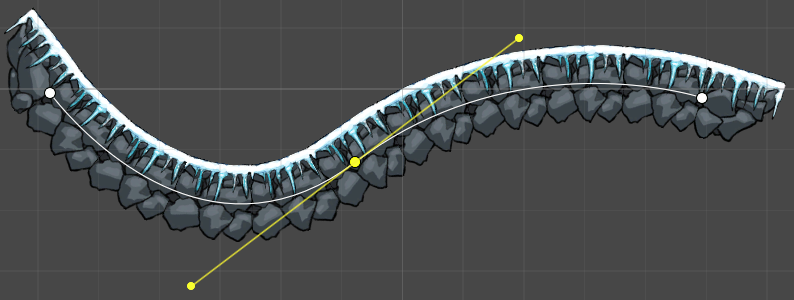 Fig 18: Sprite Shape forming a continuous platform along the spline path

1. First, prepare the base Sprite correctly before it is used into the Sprite Shape Profile.  Fig 19: The original Sprite

&nbsp;&nbsp;&nbsp;&nbsp;&nbsp;Import the Sprite into the Project, and open the [Sprite Editor](https://docs.unity3d.com/Manual/SpriteEditor.html) to edit its borders.

&nbsp;&nbsp;&nbsp;&nbsp;&nbsp;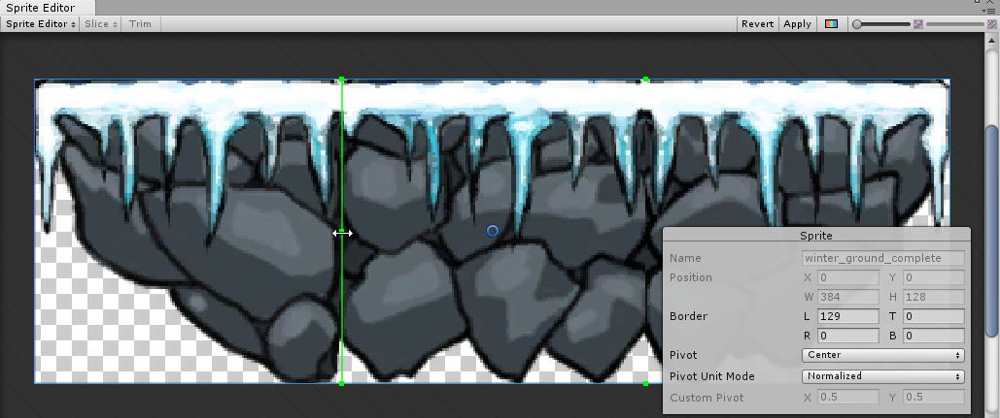 &nbsp;&nbsp;&nbsp;&nbsp;&nbsp;Fig 20: Creating borders in the Sprite Editor

&nbsp;&nbsp;&nbsp;&nbsp;&nbsp;The border is shown as a green outline along the edge of the Sprite. Click and drag the Control Points for the border on either side, and divide the Sprite into 3 sections - a middle section to be repeatedly tiled, and two to be bookends to the tiled path.

&nbsp;&nbsp;&nbsp;&nbsp;&nbsp;With the *Strip* preset settings, the middle section is tiled along the spline path, and both ends of the Sprite Shape can be capped by the left and right sections defined in Fig 20.

&nbsp;&nbsp;&nbsp;&nbsp;&nbsp;Click **Apply** to save these new Sprite borders.

2. Exit the **Sprite Editor** and create a new **Sprite Shape Profile** with the *Strip* preset.  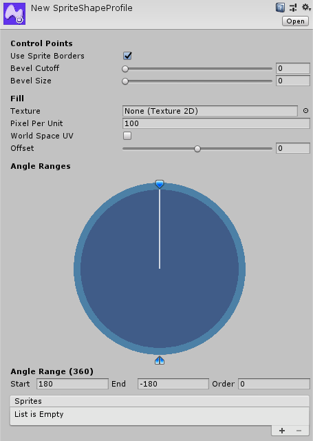 Fig 21: Default Sprite Shape profile for the *Strip *Preset

3. Assign a Sprite to the only Angle Range in the Preset.  Fig 22: The assigned Sprite appears for all angles in 360° range
Click and drag the Preview Handle to see how the same Sprite is displayed at every angle in its full 360° range. This means that no matter which angle the Sprite Shape’s, the Sprite is displayed as a continuous tiling pattern that looks like a platform. 

4. Ensure that *Use Sprite Borders* is checked in the Sprite Shape Profile settings.  Fig 23: Use *Sprite Borders* must be checked
This ensures that the left and right segments defined in Step 2 bookend the endpoints of the Sprite Shape, creating a visually complete platform.

5. Drag the **Sprite Shape Profile** into the Scene to create a Sprite Shape GameObject based on the Profile settings. 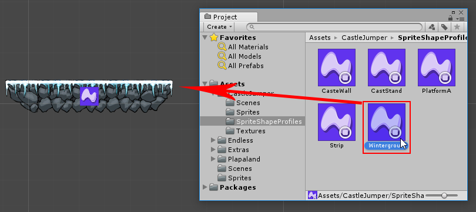 Fig 24: Sprite Shape Asset is brought into the Scene

To continue editing the Sprite Shape within the Scene, you need to adjust the settings in the **Sprite Shape Controller** component. It is automatically attached to the Sprite Shape once it is dragged into the Scene or Hierarchy.

## Using the Sprite Shape Controller

To edit the Spline path and shape of a **Sprite Shape**, click the *Edit Spline* button to make the Spline path and its Control Points become visible and editable.

 Fig 25: *Edit Spline*

Once **Edit Spline** is enabled, you can do the following:

1. Add additional Control Points by clicking anywhere along the spline path.

 Fig 26: Control point

2. Select and move Control Points to adjust the shape and length of the spline path.

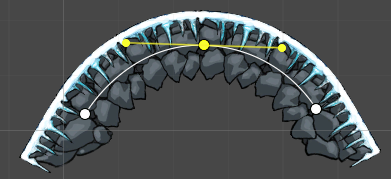 Fig 27: Set Control Point to Mirrored Mode to make curves

3. Change the **[Point Mode](#point-mode)** of the selected Control Point.

4. Set the **Sprite Index** number of the selected Control Point.

5. Set the **Corner** setting to *Automatic* or *Disabled* for the selected Control Point.

## Point Modes

When a Control Point is selected, its **Point Mode** can be changed into one of 3 modes- *Linear*, *Mirrored*, and *Non-Mirrored*. 

**Point Modes** control the behavior of tangent lines on the selected Control Point. These tangents control the shape of the curve between them, and affects how the Sprite Shape deforms. Each Control Point in a Sprite Shape can also be set to a different **Point Mode**, with its own unique settings.

### Linear Point Mode

In *Linear Point Mode*, there are no tangent lines to control the curve between the Control Point and its neighbors. Instead, the corners between Control Points are rounded off via the *Bevel Cutoff* and *Bevel Size* settings.

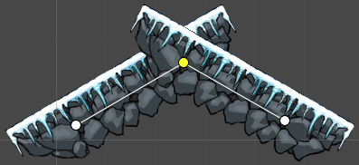 Fig 28: *Linear Point Mode*

A Control Point in the default Linear Point Mode and Bevel settings set to 0

To create a smooth rounded corner at the Control Point, first make sure that the selected Control Point and its connected neighbors all are set to *Linear Point Mode*. 

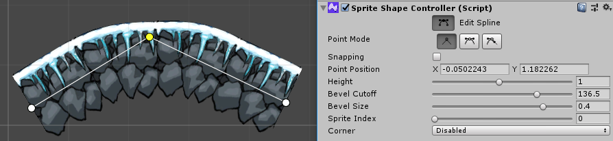 Fig 29: Corner rounded by Bevel settings (note that Sprite Borders are not displayed with Bevels)

The Control Point first refers to the *Bevel Cutoff* and *Bevel Size* settings in the original **Sprite Shape Profile** Asset to create rounded corners. However, adjusting the same settings in the **Sprite Shape Controller **overrides the original Profile settings. These override values are unique to each Control Point.

### Mirrored/Non-Mirrored Point Mode

In these two modes, tangent lines appear on either side of the selected Control Point, and the *Bevel Cutoff* and *Bevel Size* settings are ignored.

 Fig 30: Control Point in Non-Mirrored Point Mode

Adjusting the tangents controls the curve of the spline between a selected Control Point and its neighbors.

## Sprite Index

The *Sprite Index* number determines what Sprite is shown in between two Control Points. The number refers to a row on the Sprites list, and the Sprite assigned to that row.

### Adding to the Sprite Index List

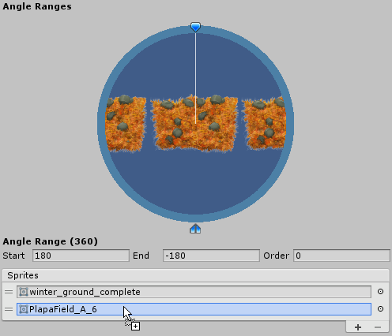 Fig 31: Multiple rows in *Sprites List*

To add additional Sprites to the Sprites list, open the **Sprite Shape Profile** to find the list of Sprites currently assigned to the Sprite Shape under the Angle Ranges tool.

Click the + icon to add another row to the list. Add a Sprite to the list by dragging it onto the empty row. Clicking the circle icon on the right opens the Object Picker window and allows you to select an available Sprite as well.

The Sprite at the top of the list is the default Sprite displayed by the Sprite Shape at Sprite Index 0. The next Sprite in the list given index number 1, and so on.

### Changing the Sprite Index Number 

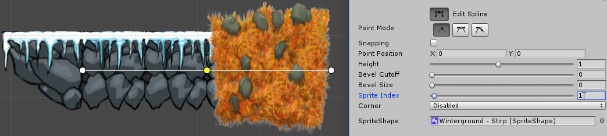 Fig 32: *Sprite Index* slider and field

To display a different a Sprite at a Control Point:

1. Select the **Sprite Shape**, and go to the attached **Sprite Shape Controller** component settings. 

2. Check the *Edit Spline* option, and select a Control Point.  

3. Adjust the Control Point’s *Sprite Index* setting with the slider, or enter the index value. Note that setting the Sprite Index number to one that doesn’t exist in the Sprite List displays the default Sprite instead.

# Closed Sprite Shapes

Although open-ended Sprite Shapes are commonly used to create simple platforms, closed Sprite Shapes are useful when creating more detailed level designs. For example, to create background elements or complicated platforms.

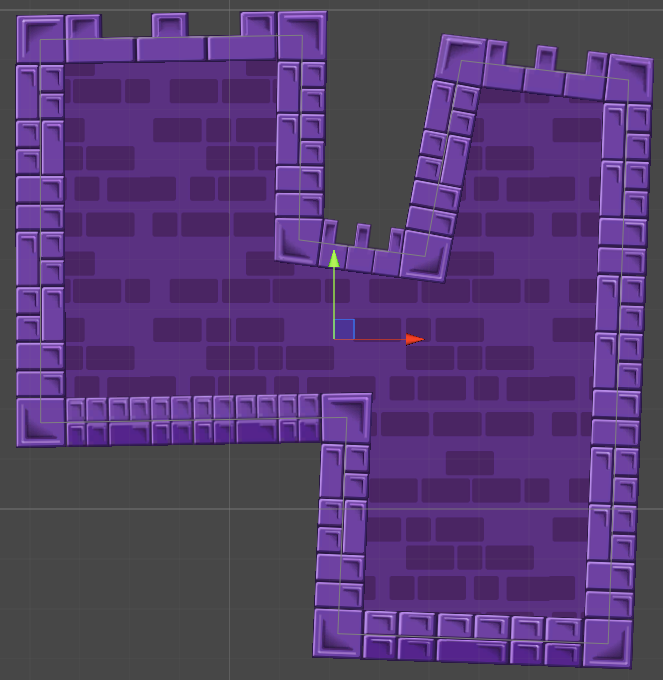 Fig 33: Closed Sprite Shape, with automatic Corners and a Fill texture

Constructing a closed Sprite Shape allows it to use additional Sprite Shape features such as automatic *Corners* and displaying a *Fill* textures. A Sprite Shape becomes ‘closed’ by clearing the *Open Ended* checkbox in the **Sprite Shape Controller** options (see Fig 34 below). 

 Fig 34: The *Open Ended* checkbox

If an Open-Ended Sprite Shape was already present in the Scene, clearing the checkbox causes the two endpoints of the Sprite Shape to automatically connect to form a closed shape.

## Corners

The *Corners* settings displays the list of Sprites that are currently assigned to their respective corners (see Fig 35).

 Fig 35: Corner settings in the **Sprite Shape Profile**

When the Sprite Shape is rendered in the Scene, the assigned Sprites are displayed at the respective corners (see Fig 36).

Note that a corner Sprite is only displayed if the Control Point and its neighbors are all in *Linear Point Mode*.

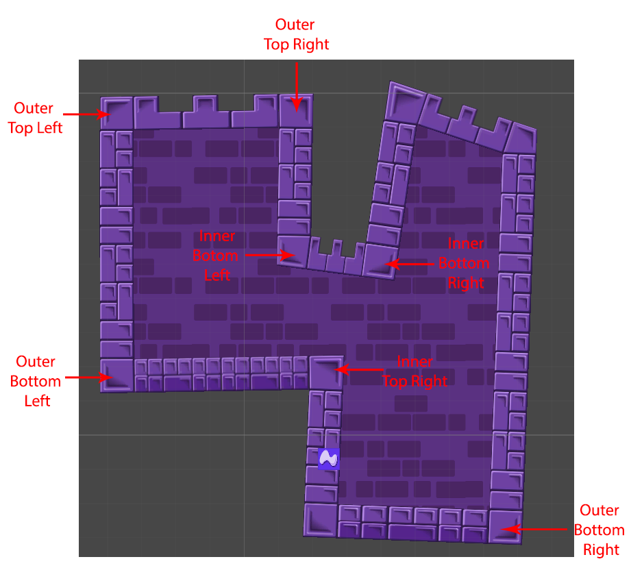 Fig 36: Corresponding Corners automatically generated on the Sprite Shape

## Fill

 Fig 37: *Fill *settings in the **Sprite Shape Profile**

In the **Sprite Shape Profile**, you can select a texture that automatically fills any closed Sprite Shape derived from the same **Sprite Shape Profile.** This setting has no effect if the Spline is set to *Open Ended*.

The *Pixel Per Unit *setting allows you to scale the Fill texture, while the *Offset* slider allows the Fill texture to bleed out or retract from the edges of the Sprite Shape if needed.

Enabling the *World Space UV* setting causes the Fill texture to refer to the World Space UV, instead of per Object UV. By default, *World Space UV* is disabled, and each Sprite Shape’s Fill texture refers to its own Object UV (see Fig 37).

 Fig 37: Two Sprite Shapes from the same **Sprite Shape Profile**, *World Space UV* unchecked

 Fig 38: Same Sprite Shapes, with *World Space UV* enabled

With *World Space UV* enabled, Sprite Shapes derived from the same **Sprite Shape Profile** appear to overlay a single large Fill texture that spans the entire layer instead.

# Enabling Collision

To enable your Sprite Shape to respond to 2D physics, attach a **Collider 2D** component to the Sprite Shape.

 Fig 39: List of Collider 2D components 

All Collider 2D components can be used, except for the *Tilemap Collider 2D*. However, the **Sprite Shape Controller’s** Collider properties are only available if either a *Polygon Collider 2D* or *Edge Collider 2D* is attached.

 Fig 40: Polygon Collider 2D green outline over Sprite Shape

When first attached, the Collider’s mesh and outline does not match the Sprite Shape (see Fig 40). To automatically match the Collider mesh to the Sprite Shape, go to the Sprite Shape Controller’s *Collider* settings (see Fig 41), and check the *Update Collider* checkbox.

 Fig 41: *Update Collider *automatically edits the Colldier outline to match the Sprite Shape

To make manual edits to the Collider mesh, go to the component’s settings and enable *Edit Collider* to move and create the Collider mesh’s control points (see Fig 42).

 Fig 42: Editing the Collider mesh manually

Note that Colliders are unique to each instance of the **Sprite Shape Profile** in the Scene. To duplicate a Collider mesh, you must duplicate the entire Sprite Shape object it is attached to as well.

