## **Overview**

The Sprite Shape is a sprite layout or world building tool that provides the ability to tile sprites along the path of a shape based on given angle ranges. Additionally the shape can be filled with a tiling texture.

Sample game levels created entirely with Sprite Shape

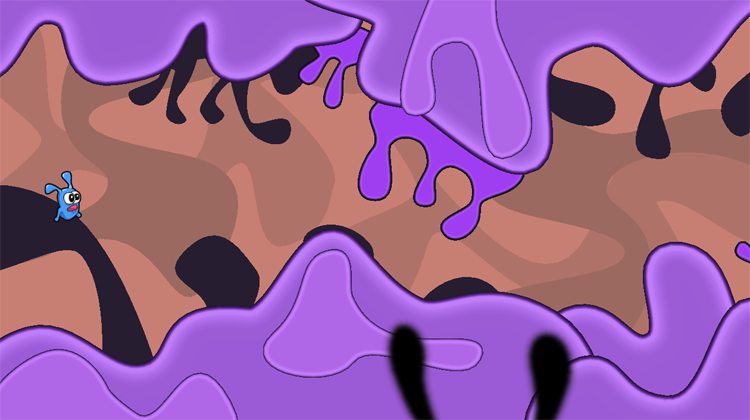

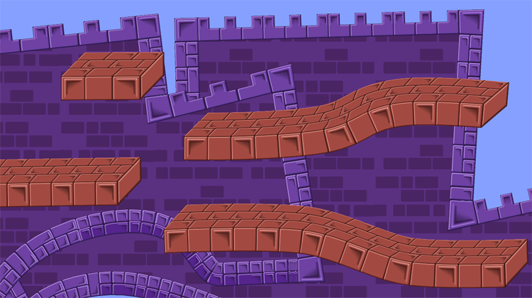

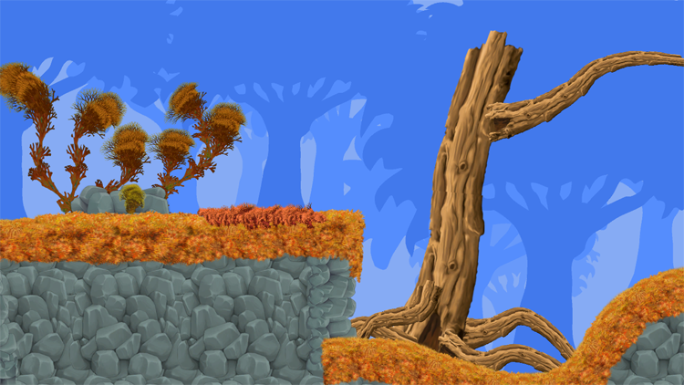

The main feature of the Sprite Shape is the powerful combination of a bezier spline path with the ability to tile Sprites adaptively or continuously while automatically switching  Sprites assigned to given angles.

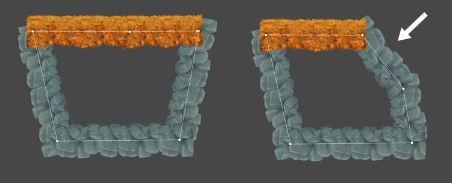

*Example01. When the angle of the path has been changed by moving the Control Point, the Sprite is automatically changed to the one specified for that angle range.*

The Angle Range Gizmo provides a quick and convenient way to setup and preview ranges visually.

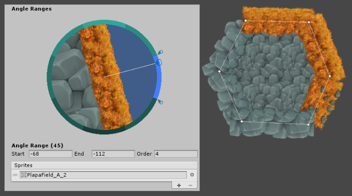

Instead of having to figure out the appropriate angle, vector, direction or Normal of the path between Control Points the Angle Range Gizmo provides a visual mapping of angle range to scene view of how the Sprites will be rendered along the path.

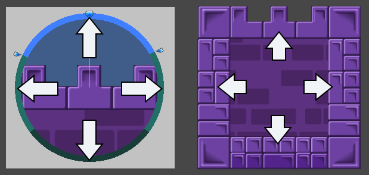

Input Sprites are always extracted horizontally and mapped accordingly, counter-clockwise along the path of the Sprite Shape.

The Sprite Shape GameObject requires a Sprite Shape Profile asset. The asset holds the “Settings” applied to or reused on multiple Sprite Shapes. 

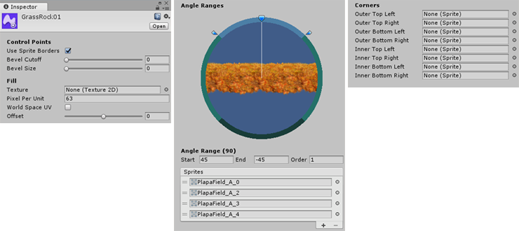

*Example02. Sprite Shape Profile. This is where the different settings are setup, such as Angle Ranges and the Sprites to be used or a Fill Texture. The profile is then used by the Sprite Shape GameObject.*

### Creating a Sprite Shape Profile

The Sprite Shape is a type of Asset in Unity projects. To create a Sprite Shape select **Asset -> Create -> Sprite Shape Profile -> ...** from the main menu.

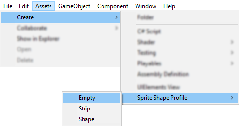

There are 3 options available. Empty which is the default Sprite Shape Profile, Strip and Shape, which have preset angle ranges. This example will be using the Empty Profile.Select the newly created asset to view its inspector. This is where we will setup the Fill texture, the Angle Ranges and assign Sprites to the Angle Ranges.

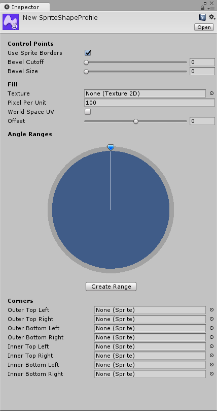

*Sprite Shape Profile Asset*

### Creating and Editing Angle Ranges

1. Create an Angle range. Click on the Create Range button.

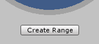

2. An Angle Range will be created where the Preview Handle is located.

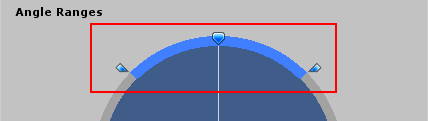

3. The values of the Angle Range will be displayed below

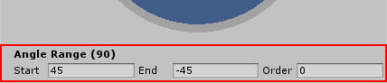

4. Including a reorderable list for the sprites to be used by the selected range.

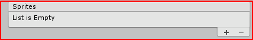

5. Positioning the Preview Handle in an area where an Angle Range has not been defined, will reveal the Create Range button.

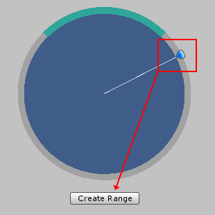

6. You can also create an Angle Range by hovering the mouse over an empty area of the Angle Range circle. An indicator will highlight a possible range. Left-click to create a range in the indicated area.

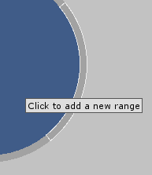

7. To delete an Angle Range, first select the range by either moving the Preview Handle to a range or directly selecting a range by clicking on it. Then remove the selected range with the Delete key.
8. To assign some Sprites to the range. Select a range and drag a Sprite to the List below the Angle Range Gizmo. A preview of the Sprite will be shown in the Angle Range Gizmo.You can move the Preview Handle along the range to preview how the Sprite will look at that angle. 

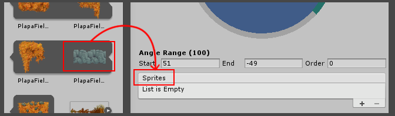

### Creating and Editing the Sprite Shape

1. Dragging the Sprite Shape Profile asset into the Scene View will create a Sprite Shape GameObject using the Profile.

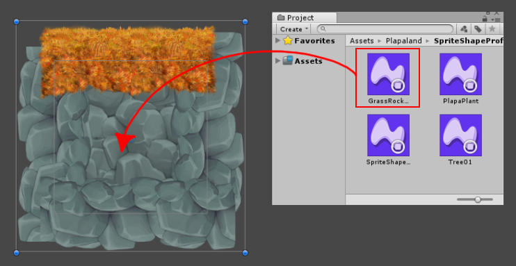

2. To start editing the path, Click on the Edit Spline button.

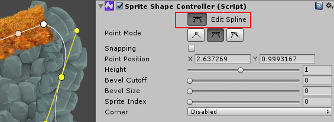

When a Control Point is selected, additional parameters are available for the selected Control Point. Refer to the Sprite Shape Controller section below for more information. Commonly used options are 

- Point Mode, which changes the Control Point bezier control between Linear, MIrrored or Not Mirrored (commonly referred to as “Broken”).
- Height vertically scales the sprite at the selected Control Point
- Sprite Index refers to the currently rendered Sprite at the selected Control Point based on the Sprites in the List for the current Angle Range.

## Sprite Shape Profile Asset

The asset is where you will set the parameters for the Sprite Shape. Angle Ranges, Sprites, Fill Texture etc.

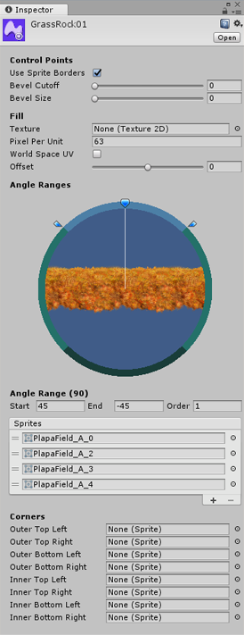

### **Sprite Shape Profile Parameters**

| **Control Points**   |                                          |
| :------------------- | :--------------------------------------- |
| Use Sprite Borders   | Sprites will be tiled using the Sprite Borders setup in the Sprite Editor |
| Bevel Cutoff         | Controls the length of the fillet        |
| Bevel Size           | Controls the amount of tolerance before a corner becomes a rounded corner or breaks continuity |
| **Fill**             |                                          |
| Fill Texture         | The Texture to be used to fill the inside of the shape |
| Fill Pixels Per Unit | The pixels per unit value for the fill texture |
| World Space UV       | The texture will be applied in World Space |
| Offset               | Scales the fill shape. Does not scale the texture. Texture scale should be adjusted using PPU |
| **Angle Range**      |                                          |
| Sprites              | The Sprites to be tiled along the spline. |
| **Corner Sprites**   |                                          |
| Corner Type          | “Activates” a Corner Type                |
| Sprites              | Sprite to be assigned to the particular corner type. |
|                      |                                          |

## **Sprite Shape Controller**

The Sprite Shape Controller is used on the actual Sprite in the Scene. It has overrides for some the settings from the asset. It also provides finer manipulation for Control Points.

[Image of Sprite Shape Controller]

| Edit Spline       | Enables editing the Control Points of the Spline |
| ----------------- | ---------------------------------------- |
| Sprite Shape      |                                          |
| **Sorting Layer** |                                          |
| Order in Layer    |                                          |
| **Spline**        |                                          |
| Detail            |                                          |
| Open Ended        |                                          |
| Adaptive UV       | Tiling of the sprites along the spline will be done adaptively. |
| Corner Tolerance  | **Controls the amount of tolerance before a corner becomes a rounded corner or breaks continuity.** |
| Fillet Length     | **Controls the length of the fillet**    |
| Sprite Index      | **Changes the sprite to used at the selected Control Point |
| Corner Override   | Disables the Corner Setting for the selected Control Point** |
| Sorting Layer     |                                          |
| Order in Layer    |                                          |
|                   |                                          |
|                   |                                          |

